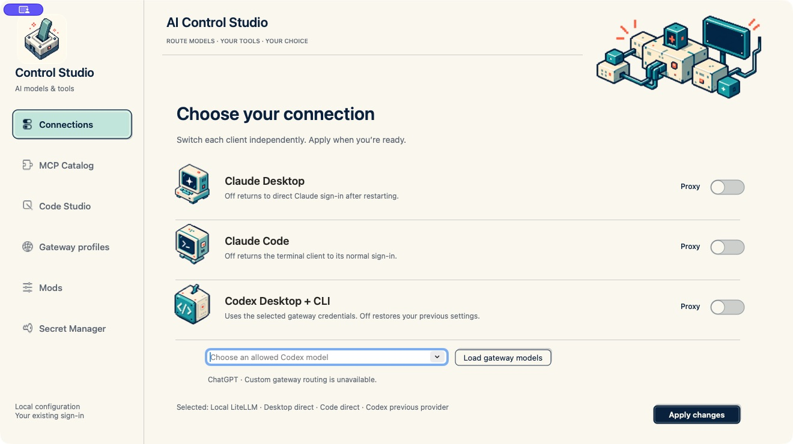
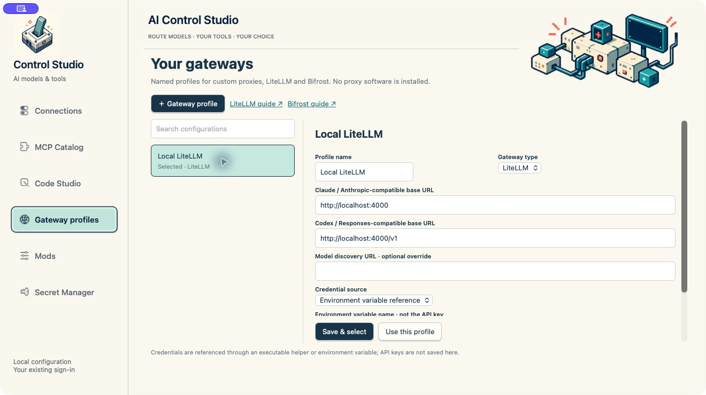
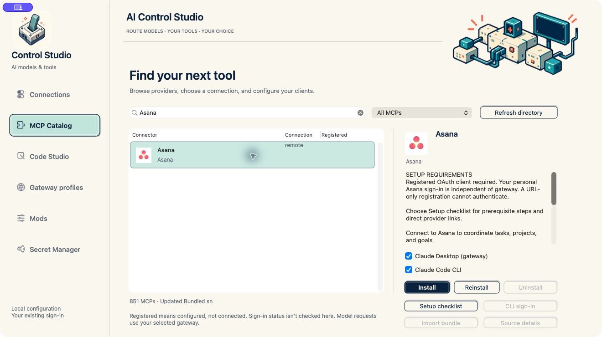
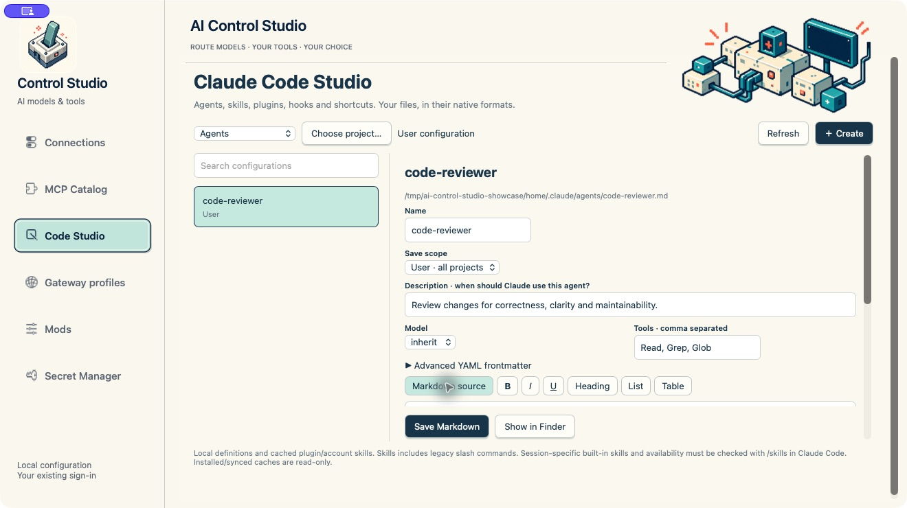
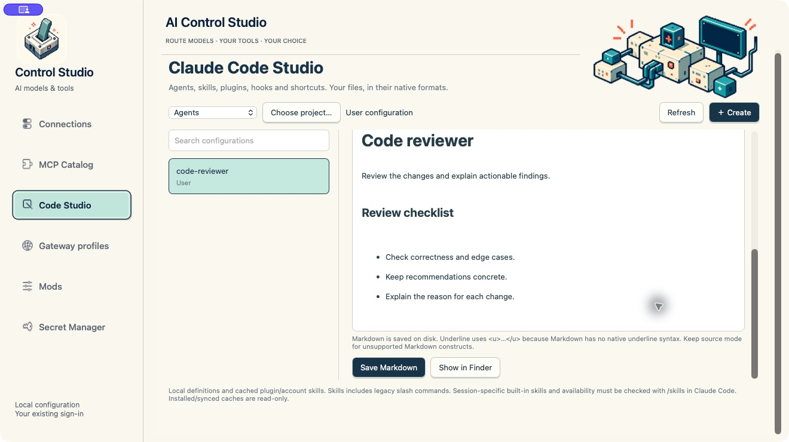
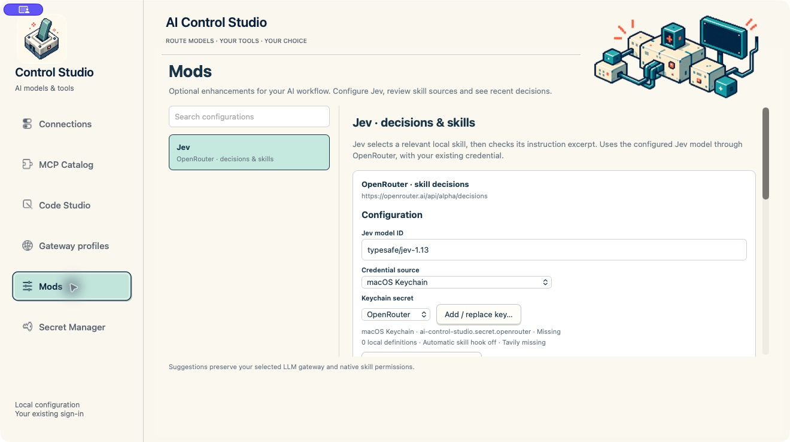
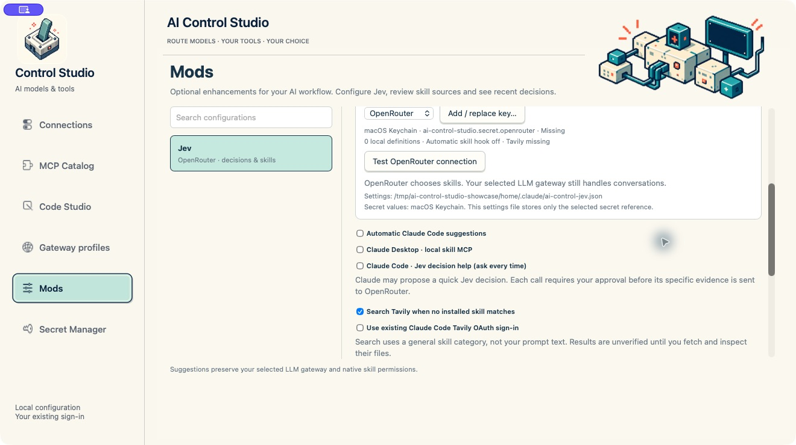
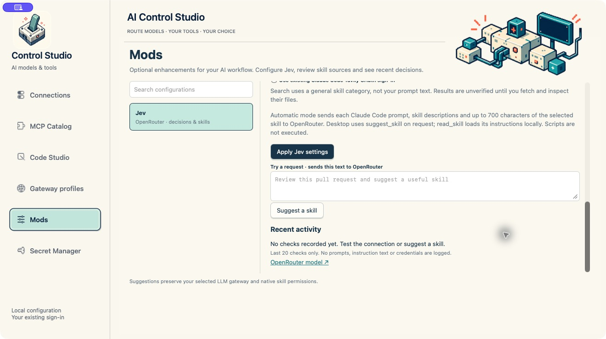
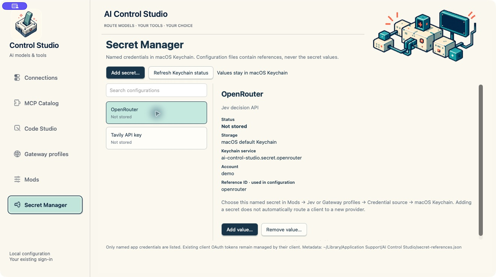

# Settings guide

These screenshots show the current native Mac interface using an isolated demo profile. The profile uses localhost example URLs and an illustrative agent. No live account, API secret or private organization configuration is shown. Secret Manager status was replaced with empty demo entries for the capture; no real Keychain was queried by that view. The screenshots are documentation, not proof of provider authentication. Scroll within a settings panel to reach controls below the fold.

## Connections

| Setting | What it does |
| --- | --- |
| Claude Desktop | Enables the selected gateway for the supported third-party Desktop deployment. Off returns to direct Claude sign-in after restart. |
| Claude Code | Enables gateway routing for the standalone terminal client. Off returns to normal client sign-in. |
| Codex Desktop + CLI | Enables the selected Responses-compatible gateway. Off restores saved previous settings. |
| Load gateway models | Requests the permitted model list using the selected gateway credential. Choose an allowed model before applying Codex routing. |
| Apply changes | Saves the selected routing. Review any client reload prompt; start a fresh terminal session where required. |

The three clients can be switched independently. Consumer ChatGPT has no custom gateway routing option here. A gateway can require a paid account, issued credential or a separate sign-in; the switches do not create these.

## Gateway profiles

Create a profile, then configure:

- **Profile name:** a label for your own deployment.
- **Gateway type:** Custom, LiteLLM, Bifrost or Ollama. Selecting a type does not install a server.
- **Claude base URL:** the deployment's Anthropic-compatible endpoint.
- **Codex base URL:** the deployment's Responses-compatible endpoint.
- **Model discovery URL:** optional override when discovery lives at a separate endpoint.
- **Credential source:** macOS Keychain, environment-variable reference or executable helper. Enter a reference or helper path, not an API key in the URL or profile text fields.
- **Apply this profile to clients already using a gateway:** enabled by default when saving. Updates currently enabled routes and offers a normal quit/reopen for affected running desktop apps. Uncheck it to save/select only; apply routing later in Connections. CLI sessions must be started again separately.
- **Save & select / Use this profile:** save the profile and selected behavior, or select an existing profile. Use Connections to enable additional clients.

HTTPS is required for remote profiles; localhost HTTP is supported. Finder-launched applications do not automatically inherit every shell environment export. Keychain references avoid that dependency. Gateway support for streaming, tools, model discovery and the Responses API must be provided by your deployment.

### Local Ollama

Choose **Ollama** to populate `http://127.0.0.1:11435` for Claude Desktop, `http://localhost:11434` for Claude Code, `http://localhost:11434/v1` for Codex and `/v1/models` for discovery. Click **Load Ollama models**, choose an exact available model ID, then save. The app does not download models or install/start Ollama. Local Ollama requires no API secret; its credential helper supplies the ignored `ollama` placeholder.

Use tool-capable models and configure sufficient context in Ollama (its coding guides recommend at least 64k). Models tagged `cloud` may use Ollama Cloud and require its sign-in. This preset accepts localhost endpoints only; use an authenticated Custom profile for a remote deployment. Claude Code receives the selected `ANTHROPIC_MODEL`; its previous model setting is restored when leaving Ollama. Desktop uses Ollama’s dedicated compatibility gateway, not the normal API. Enable Claude in Ollama’s menu-bar app and configure its model mappings there before applying Desktop routing. The app checks the gateway’s official health marker before saving client changes. Model/tool compatibility varies, so registration and routing do not guarantee every agent feature works.

References: [Ollama Claude Desktop integration](https://docs.ollama.com/integrations/claude-desktop), [Ollama Claude Code integration](https://docs.ollama.com/integrations/claude-code), [Ollama Codex integration](https://docs.ollama.com/integrations/codex), [API compatibility](https://docs.ollama.com/api/openai-compatibility).

## MCP Catalog

Search by connector, provider or category and filter local/remote entries. The bundled catalog currently includes 851 entries; this count is a snapshot, not a guarantee that every entry is installable. Refresh directory fetches current public metadata.

Select a connector to inspect its endpoint, publisher, prerequisites and available actions:

| Action | Use |
| --- | --- |
| Client checkboxes | Choose Claude Desktop gateway profile, Claude Code, or both as supported. |
| Install / Reinstall / Uninstall | Register, repair or remove the chosen configuration. Registration does not establish provider authorization. |
| Setup checklist / Provider setup | Review prerequisites and follow provider links for client registration, credentials or package downloads. |
| CLI sign-in | Open the supported Claude Code authorization workflow after registration. |
| Import bundle / Source details | Review supported local package sources and fetched files before confirming installation. |

An unavailable action is disabled. Some directory entries provide documentation only and have no installable recipe. OAuth providers may require a pre-registered client ID and allowed redirect URI; a personal provider account alone is not sufficient. A remote connector is not automatically converted into a local server. Where the catalog supplies a local alternative, review its publisher and permissions separately. Independent local alternatives are not necessarily official vendor products.

MCP traffic connects to the tool provider; model inference continues through the selected LLM route. An inference proxy does not supply OAuth registration for arbitrary MCP providers. After registration, use the client's connector controls or `/mcp` to authorize and verify availability.

## Code Studio

Use the section selector for **Agents**, **Current sessions**, **Plugins**, **Hooks & webhooks**, **Slash commands** or **Skills**. Choose a project to include project-scoped configuration. Search filters the current section; it is not a global enterprise index.

### Agents and Markdown instructions

Create or select a definition, set its name, description, model, permitted tools and save scope. Advanced YAML frontmatter preserves additional supported fields. The description explains when Claude should use the agent.

The formatted editor supports bold, italic, underline, headings, lists and tables. Save Markdown writes a native definition. Underline uses `<u>…</u>` because Markdown has no native underline syntax. Switch to Markdown source for constructs the formatted editor cannot represent faithfully. Show in Finder locates the saved file.

### Skills and slash commands

Select Skills to inspect definitions or choose **Import from URL…**. Supply a public GitHub repository, directory or supported source URL, fetch candidate skills, inspect instructions/supporting files and confirm import. Fetching does not authorize execution. Imported content can influence an AI client or contain scripts; review it first. Installed/plugin caches can appear read-only, and actual session availability must be checked with `/skills` in Claude Code.

### Plugins

Inspect existing plugin configuration, draft plugin components, validate the package structure and apply supported installation or enablement actions. Installed caches are read-only. Changes may require a new Claude Code session. Plugins can add instructions, tools and executable hooks; review the native confirmation before applying changes.

### Hooks and webhooks

Create or edit supported hook configurations with the appropriate event, matcher and target. Command hooks execute locally; HTTP hooks can send event data to an endpoint. Applying executable configuration requires confirmation. Review the destination, executable and permissions before saving.

### Current sessions

Displays the sessions reported by the supported Claude Code session command. Refresh updates the snapshot. It is not a complete inventory of nested subagents and does not provide centralized monitoring across machines.

## Mods → Jev

Jev is optional and uses OpenRouter independently of the main conversation gateway. Set its model ID, choose a credential source and select a named Keychain reference. Add/replace key opens a native secure entry dialog. Test OpenRouter connection sends a synthetic decision request and may consume provider usage.

| Control | Behavior |
| --- | --- |
| Automatic Claude Code suggestions | Installs the optional prompt hook. Sends submitted prompts, bounded skill descriptions and a selected excerpt to OpenRouter. Off initially. |
| Claude Desktop local skill MCP | Registers the local skill tools in the Desktop configuration. |
| Claude Code Jev decision help | Makes optional assistance available with approval for each decision request. |
| Search Tavily when no skill matches | Searches a general skill category for possible public sources. Results require review. |
| Use existing Claude Code Tavily OAuth | Explicit opt-in to reuse the existing Tavily MCP sign-in from the client-managed Keychain bundle. This is not a standalone Tavily API key. |
| Apply Jev settings | Saves controls and references, then offers the supported client reload flow. |

Claude Code 2.1.199+ supports the per-call interaction annotation required by decision assistance. Other clients must support the required form elicitation; unsupported clients are refused. Approval to consult Jev does not authorize subsequent consequential actions.

Suggest a skill sends the entered request to OpenRouter. Review fetched skill candidates before installing. Recent activity keeps the last 20 outcomes/timings; it does not log prompts, instruction contents or credentials. Provider usage can incur charges even when no suitable skill is found.

## Secret Manager

Add a named secret through the native secure dialog, or select a credential to add/replace its value. Remove value requires confirmation. Refresh Keychain status checks availability; it does not display secret contents. A selected secret can be referenced by Jev or a gateway profile. Adding a secret does not change routing on its own.

- **Available:** the named Keychain entry exists. It is not a live provider-validity check.
- **Not stored:** there is no separate value for that reference.
- **Keychain locked / Check failed:** resolve macOS access or Keychain availability.
- **Client OAuth credentials:** read-only references managed by the client; reconnect through that client instead of editing token bundles.

A working Tavily OAuth sign-in can coexist with “Tavily API key: Not stored.” Enable the explicit OAuth reuse option in Mods if that is the connection you want. Secret Manager lists only known app references and a supported client OAuth reference; it is not a browser for every password in the Mac Keychain.

## Files, restarts and boundaries

Private state remains in `~/Library/Application Support/AI Control Studio/`. Jev controls and reference IDs live in `~/.claude/ai-control-jev.json`. Client files remain in their standard user/project locations. API values stay in Keychain, or in an explicitly selected external environment/helper source. Existing external files and private backups are not automatically scrubbed or migrated.

After relevant changes, review the native quit/reload prompt for supported clients. Terminal configuration generally needs a new session. Never force a reload while unsaved work is at risk. This project is a local configuration utility, not a centrally enforced enterprise policy service.
